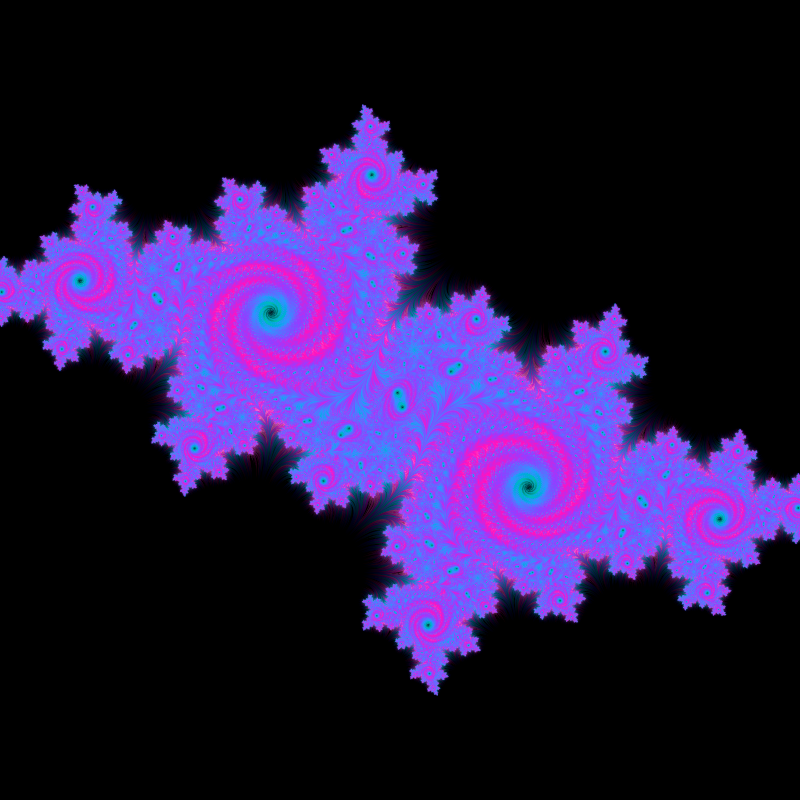
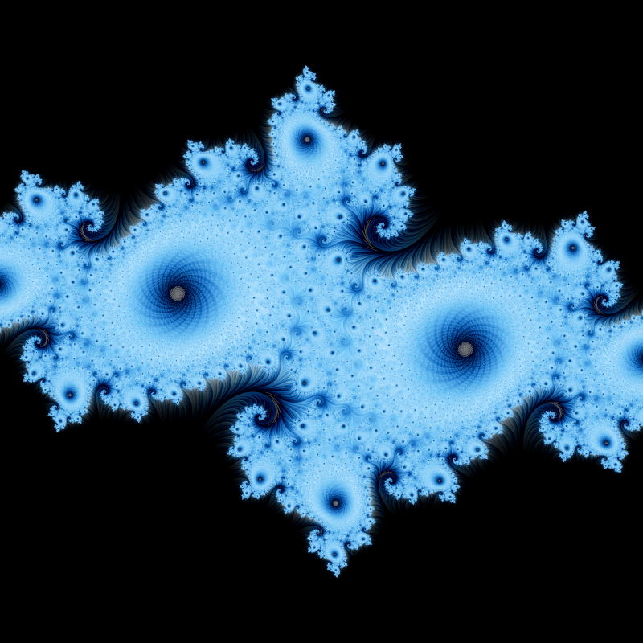
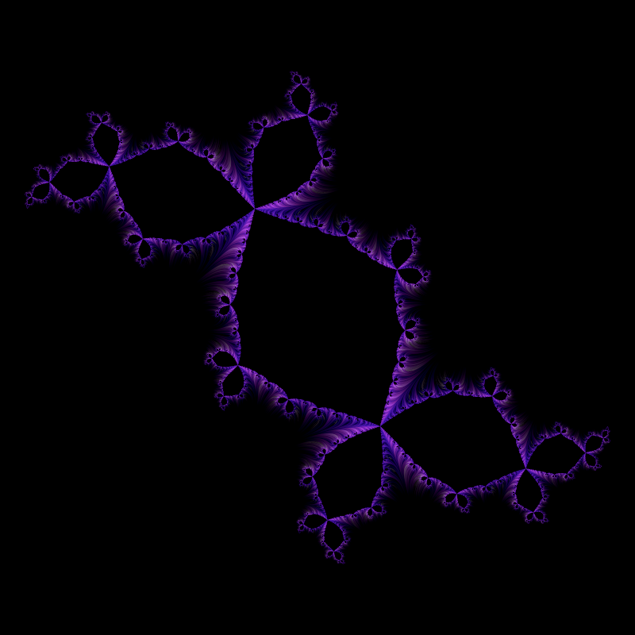
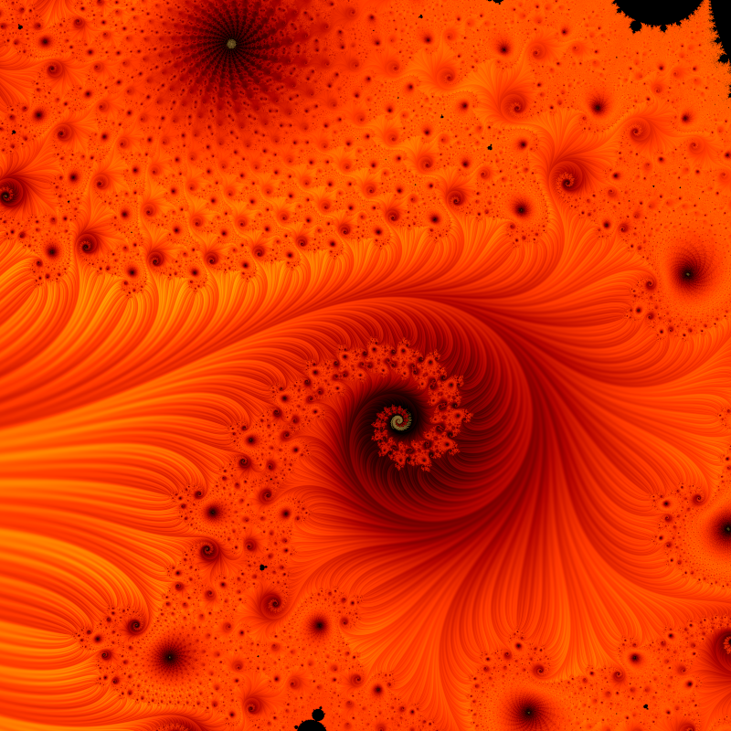
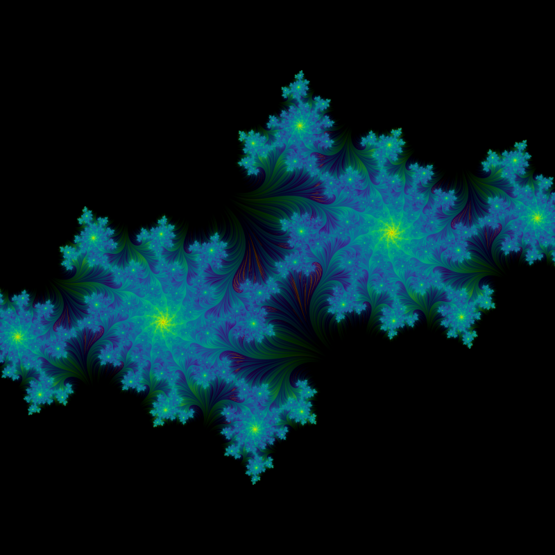
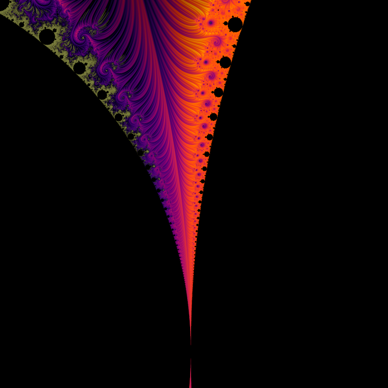

# fractal

A little command-line tool for rendering Julia and Mandelbrot sets as stills
and seamless loop videos. It runs the fractal math on the GPU (OpenGL/GLSL), so
a 4K still at 16x supersampling comes back in well under a second on Apple
Silicon.

The coloring is the interesting part — see [how it works](#how-it-works).


Every image below is a one-word **preset** (`-P <name>`), each landing on a
different region of a Julia or Mandelbrot set:

| | | |
|---|---|---|
| <br>`-P acid-swirl` — default Julia, teal/fuchsia | <br>`-P frostbite` — a dendrite arm | <br>`-P galaxy` — the "rabbit" |
| <br>`-P ember-seahorse` — Mandelbrot seahorse | <br>`-P viridian` — a different Julia | <br>`-P inferno-valley` — a Mandelbrot valley |

...and here's the full set of presets:


Video examples: a seamless [rotating loop](assets/loop_magma.mp4) and a
[rapid zoom](assets/zoom_seahorse.mp4) into the seahorse valley.

## Album art

There's a design layer on top of the fractal for making covers — four
composable, toggleable modes, each with a ready-made `cover-*` preset on a
fuchsia-forward neon palette (`vice`). All are square; render at `--size
3000x3000` for streaming/print.


```sh
fractal render -P cover-mandala --size 3000x3000 -o cover.png  # radial symmetry
fractal render -P cover-hero    --size 3000x3000 -o cover.png  # cinematic spiral
fractal render -P cover-glitch  --size 3000x3000 -o cover.png  # RGB-split + scanlines
fractal render -P cover-cosmic  --size 3000x3000 -o cover.png  # soft nebula glow
```

The modes are just flags, so you can mix them onto any render:

| flag | effect |
|---|---|
| `--kaleido <N>` | fold the view into N mirrored wedges → mandala (`--kaleido-angle` to rotate) |
| `--aberration <px>` | chromatic RGB split along the radius (neon fringing) |
| `--scanlines <0..1>` | CRT scanlines |
| `--vignette <0..1>` | darken the corners to seat the focal point |
| `--grain <0..0.1>` | film grain so flats read as texture, not plastic |

E.g. a kaleidoscope on the seahorse in your own colors:
`fractal render -P ember-seahorse --kaleido 12 --vignette 0.4 -o cover.png`.

## Build

macOS / Apple Silicon. You need clang (Xcode command-line tools), GLFW, and
ffmpeg if you want video:

```sh
brew install glfw ffmpeg
make            # -> ./fractal
make test       # unit tests, no GPU needed
```

It links Apple's system OpenGL (which runs on Metal) plus GLFW — no GL loader
to mess with.

## Usage

```sh
fractal render [options]      # one still image -> PNG
fractal video  [options]      # seamless loop -> MP4
fractal help                  # every option
```

The fastest way to something good is a preset:

```sh
fractal render -P frostbite -o spiral.png        # blue spiral
fractal render -P acid-swirl -o trippy.png       # fuchsia/teal, full default set
fractal render -P ember-seahorse --ssaa 6 -o seahorse.png
fractal render -P dusk -o sunset.png             # warm spiral
fractal help                                     # lists all presets
```

Presets are just a starting point — override any field with a flag, e.g.
`fractal render -P frostbite --cre -0.8 -p ocean`. Or build it up by hand:

```sh
fractal render --cre -0.7269 --cim 0.1889 --scale 1.1 -i 4000 -p magma -o magma.png
```

A 20-second loop:

```sh
# the julia constant orbits the origin, so it loops perfectly
fractal video --mode rotate -p magma -d 20 --fps 30 -o loop.mp4

# rapid zoom into the seahorse valley
fractal video --type mandelbrot --mode zoom \
              --center-x -0.7453 --center-y 0.1127 \
              --zoom-target-x -0.7453 --zoom-target-y 0.1127 \
              --scale 0.2 --zoom-end 0.0013 \
              -i 2000 -p inferno --ssaa 4 -w 1080 --height 1080 \
              --fps 60 -d 8 -o zoom.mp4
```

For zooms, keep the target on a detail-rich spot and don't go below ~`0.001`
scale — the shader is 32-bit float, so it pixelates past roughly 10,000×.

Palettes are dark→bright ramps so detail stays readable instead of turning into
rainbow mush. The restrained ones: `noir` (default), `frost`, `magma`,
`viridis`, `inferno`, `plasma`, `cividis`, `ember`, `ice`, `fire`, `mono`. The
wider-gamut themes: `sunset`, `ocean`, `neon`, `candy`, `gold`, `emerald`,
`vapor`, `prism` (teal↔fuchsia), `aurora`, `bloom`, `psychedelic`. Or
pass your own hex list, e.g.
`-p "#00040c,#2f6fb0,#eaf7ff"`.

The knobs worth knowing (`fractal help` has the rest):

| flag | what it does |
|---|---|
| `-P, --preset` | start from a curated combo (run `fractal help` for the list) |
| `--cre`, `--cim` | the Julia constant — biggest lever on the shape |
| `--zoom` / `--scale`, `--center-x/y` | where you're looking |
| `-i, --iterations` | more = finer filaments resolved (deep zooms need a lot) |
| `--stripe-freq`, `--stripe-contrast` | the relief texture |
| `--color-density` | iteration-layer ramp; `0` = stripe layer only |
| `--stripe-color` | stripe overlay weight; `0` = iteration layer only |
| `--bloom` | luminous glow on bright areas (`0` = off) |
| `--black-point` | crush near-blacks so empty regions stay truly black |
| `--shading`, `--specular` | optional height-field lighting (off by default) |
| `--ssaa` | supersampling per axis (1–8) |

## How it works

Two layers, combined per pixel:

1. **Iteration layer** — standard escape-time, mapped so the fast-escaping
   exterior goes dark and the slow-escaping filaments stay bright. This is what
   draws the structure and the fine dendrite tendrils threading into the black.
2. **Stripe Average Coloring** — averages `½ + ½·sin(s·arg z)` along the orbit,
   then interpolates by the fractional escape count to kill the banding. The
   result is a smooth field whose contours follow the fractal's flow, so it
   reads as 3D relief without any actual lighting. This is Jussi Härkönen's
   2007 method; I followed Phil Thompson's
   [writeup](https://philthompson.me/2023/Stripe-Average-Coloring.html), which
   also explains the overlay idea.

The iteration layer gates the stripe layer: empty gaps go black, structure
shows the full relief, and the tendrils carry the texture out into the void.
Set `--stripe-color 0` to see the iteration layer alone, or `--color-density 0`
for the stripe layer alone.

A couple of other things going on:
- **bloom** — the bright filaments get blurred and screen-blended back in, so
  they glow a little (on by default; `--bloom 0` turns it off)
- optional **height-field lighting** — treats the relief as a height map and
  lights it with diffuse + specular (Blinn-Phong) for a polished, lit look.
  Off by default; `--shading 0.3 --specular 0.6` to try it
- exterior fade and optional filament glow use Iñigo Quilez's
  [distance estimate](https://iquilezles.org/articles/distancefractals/)
- supersampling is resolved in linear light so edges don't darken
- `magma` and `viridis` are the matplotlib colormaps (perceptually uniform,
  which is why they never look muddy)

## Credits

- Stripe Average Coloring — Jussi Härkönen (2007), via [Phil Thompson](https://philthompson.me/2023/Stripe-Average-Coloring.html)
- Distance estimation — [Iñigo Quilez](https://iquilezles.org/articles/distancefractals/)
- PNG writing — [stb_image_write](https://github.com/nothings/stb) (Sean Barrett)
- [GLFW](https://www.glfw.org/) for the GL context, [ffmpeg](https://ffmpeg.org/) for video

## License

MIT — see [LICENSE](LICENSE).
