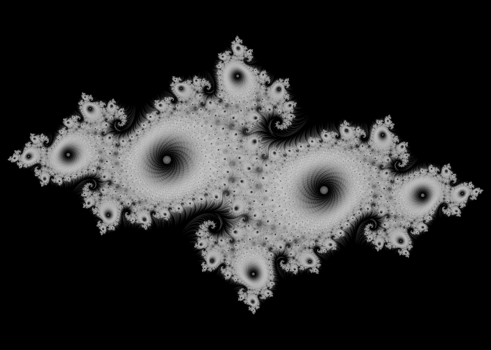
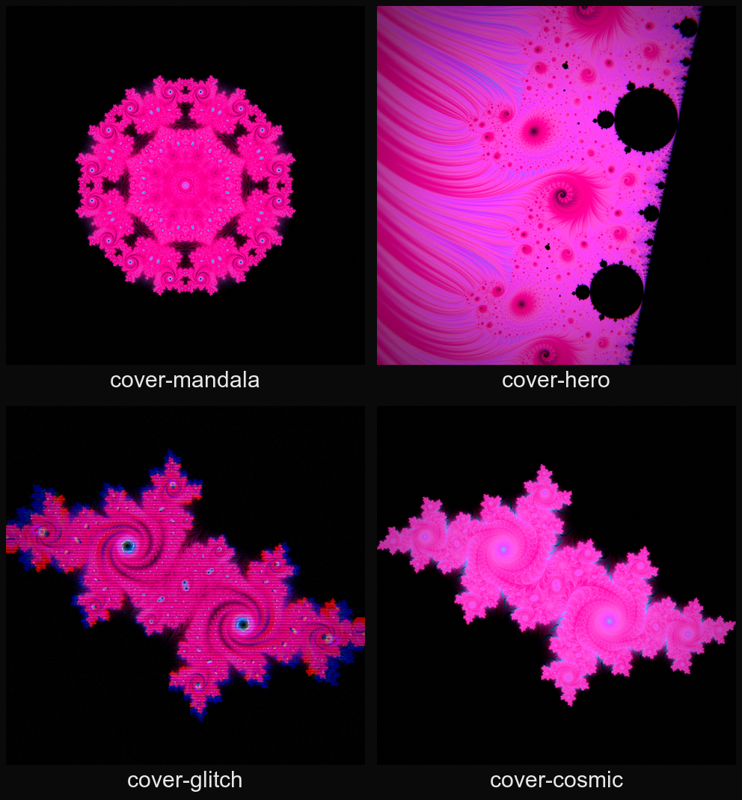
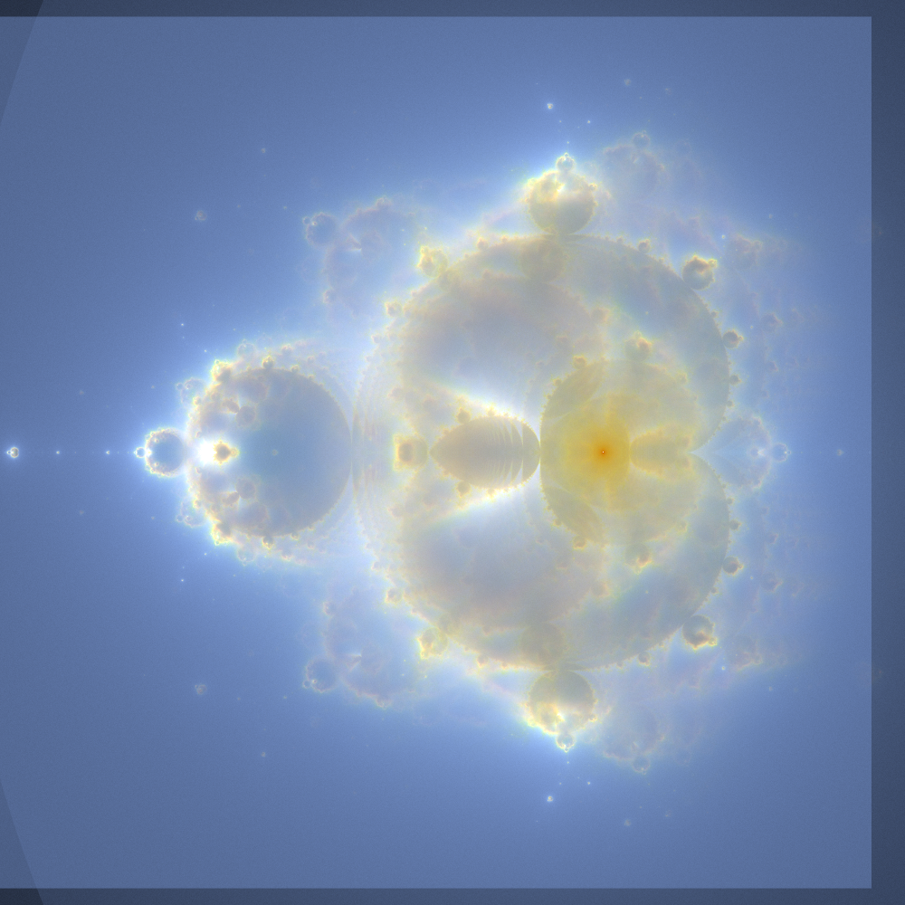
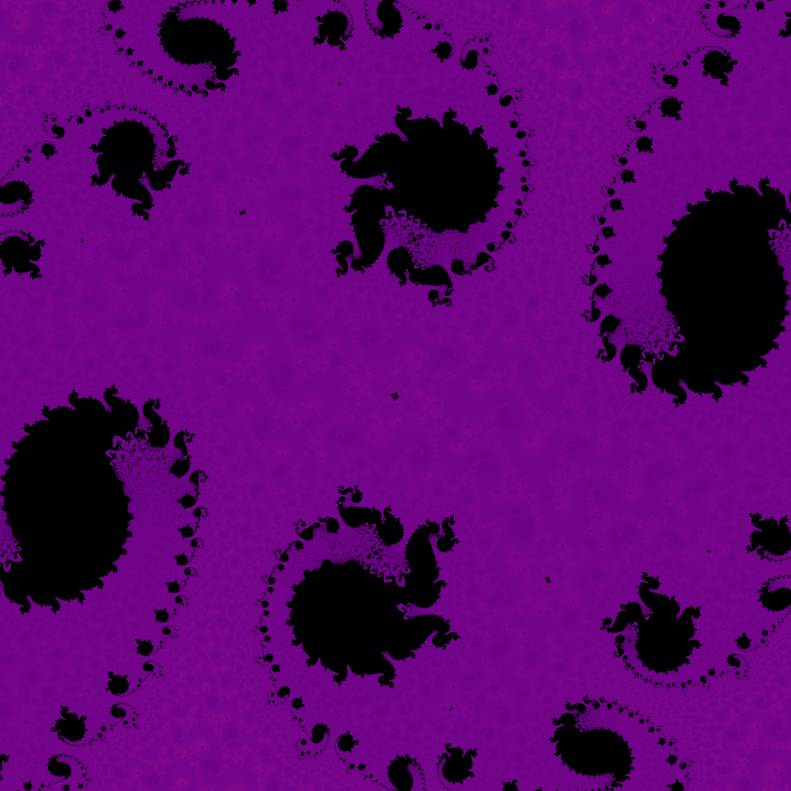

# fractalscape

A GPU command-line renderer for Julia and Mandelbrot fractals. It outputs stills
(PNG) and seamless loop videos (MP4). The iteration runs in a GLSL shader, so a
4K still at 16x supersampling renders in under a second on Apple Silicon. The
coloring is stripe-average relief over an escape-time layer; see
[how it works](#how-it-works).



## Build

macOS / Apple Silicon. Needs clang, GLFW, and ffmpeg (for video):

```sh
brew install glfw ffmpeg
make            # -> ./fractal
make test       # GL-free unit tests
```

It links Apple's system OpenGL (which runs on Metal) plus GLFW.

## Usage

```sh
fractal render [options]   # still -> PNG
fractal video  [options]   # animation -> MP4
fractal help               # every flag, palette, and preset
```

Start from a one-word preset and override anything with a flag:

```sh
fractal render -P frostbite -o spiral.png
fractal render -P acid-swirl --size 2000x2000 -o trippy.png
fractal render -P frostbite --cre -0.8 -p ocean -o custom.png   # presets are defaults
```


## Fractal families

`--formula` picks the iteration, separately from `--type julia|mandelbrot`:
`quadratic` (default), `burningship`, `tricorn`, `phoenix`, `newton`. The first
four are escape-time and share the coloring; `newton` colors the three root
basins of z^3-1. Presets: `burning-ship`, `phoenix`, `newton`.

```sh
fractal render -P burning-ship -o ship.png
fractal render -t mandelbrot --formula tricorn -p frost -o tricorn.png
```

## Coloring techniques

The default look is two layers — a smooth-iteration ramp for structure and
Stripe Average Coloring for relief — but the full vocabulary goes much further.
Everything composes, and every technique has a preset to start from:

- **Relief modes** (`--relief`): `sac` orbit-angle fur (default), `tia`
  triangle-inequality flame plumes (`flame-mandel`), `curvature` angular
  marbled ridgelines from the orbit path's turning angle (`marble-vein`).
- **Interior modes** (`--interior`): the set body doesn't have to be black.
  `bof60` colors by the orbit's closest approach to the origin — the glowing
  nested-embryo render from *The Beauty of Fractals* p.60 (`ember-eyes`);
  `bof61` by *which* iteration came closest — flat atom-domain cells keyed to
  period (`atom-cells`); `expsmooth` by convergence speed (`glass-lake`);
  `sac` by the orbit's stripe value (`interior-bloom`).
- **Binary decomposition** (`--decomp`): the classic Peitgen black/white grid
  of external rays x equipotentials (`peitgen-grid`), or as a color overlay on
  log-iter bands (`ray-stain`).
- **Orbit statistics**: shaped orbit traps — point, cross, circle, astroid,
  diamond, hyperbola, waves, log-spiral (`--trap-shape`, `whirlpool`,
  `neon-astroid`); Pickover stalks (`stardust`); Gaussian-integer lattice
  distance for a crystalline grid texture (`--gauss-color`, `crystal-court`).
- **Slope-angle sheen** (`--sheen`): the *direction* of the escape-time
  gradient drives hue — an iridescent oil-film shimmer (`oil-slick`).

The complete catalogue — every technique with its math, flags, source, and
example preset — is in [TECHNIQUES.md](TECHNIQUES.md).


## Animation

`fractal video` has four modes. Three of them are seamless loops:

| mode | what moves | example |
|---|---|---|
| `rotate` | Julia constant orbits, so the shape morphs | [loop_rotate.mp4](assets/videos/loop_rotate.mp4) |
| `cycle` | palette sweeps one full cycle | [loop_cycle.mp4](assets/videos/loop_cycle.mp4) |
| `spin` | a kaleidoscope axis turns one full revolution | [loop_spin.mp4](assets/videos/loop_spin.mp4) |
| `zoom` | continuous dive toward a target (one-shot, not a loop) | [zoom_seahorse.mp4](assets/videos/zoom_seahorse.mp4) |

```sh
fractal video -P cover-mandala --mode spin -d 8 -o spin.mp4
```

`--color-cycles N` overlays N palette sweeps onto any mode, so you can cycle
colors while zooming (it forces a cyclic gradient so the sweep stays smooth).

## Covers and the design layer

Off-by-default toggles: `--kaleido N` (mirrored-wedge mandala), `--aberration`
(RGB split), `--scanlines`, `--vignette`, `--grain`. Four square `cover-*`
presets combine them on the neon `vice` palette. Render at `--size 3000x3000`
for streaming or print.



Mix them onto any render, for example `fractal render -P ember-seahorse
--kaleido 12 --vignette 0.4`. [assets/showcase/cover.png](assets/showcase/cover.png) is
the `cover-hero` location with the `cover-glitch` treatment.

## Buddhabrot and Nebulabrot

A different way to draw the set. Instead of coloring a pixel by how its own
orbit escapes, `fractal buddhabrot` fires millions of random orbits and
accumulates the paths of the ones that escape into a density buffer. Interior
orbits are thrown away, which is what leaves the ghostly nebula. This is a
scatter operation that macOS OpenGL can't do (no compute shaders or image
atomics at 4.1), so it runs multithreaded on the CPU.

```sh
fractal buddhabrot -t mandelbrot --nebula --samples 250 -o nebula.png
fractal buddhabrot -t mandelbrot --samples 250 -i 2000 -p gold -o buddha.png
```

`--samples` (in millions) is the quality lever. `--nebula` renders three
iteration thresholds into red, green, and blue for the classic Nebulabrot;
without it the single-channel density is colored through the palette. Quadratic
only, and it is happiest on wide views.



## Interactive explorer

`fractal explore` opens a live window. Drag to pan, scroll to zoom toward the
cursor, and use the keyboard to cycle palettes and formulas, morph the Julia
constant with the arrow keys, toggle deep precision, and so on. Space prints a
`fractal render` command that reproduces the current view (so you can re-render
it at full resolution), and Enter saves a PNG snapshot. The full key map prints
on launch.

```sh
fractal explore -P ember-seahorse
```

To get a double-clickable macOS app instead of the CLI, build a bundle:

```sh
make app          # -> FractalScape.app
open FractalScape.app
```

`make app` wraps the binary and its shaders into `FractalScape.app` (icon
included) and clears the quarantine bit so it launches unsigned. Double-click it
in Finder, or drag it to your Applications folder or Dock. It opens straight
into the explorer.

## How it works

Two layers, combined per pixel:

1. Iteration layer: escape-time, mapped so the fast-escaping exterior goes dark
   and slow-escaping filaments stay bright. This draws the structure and the
   tendrils that thread into the black.
2. Stripe Average Coloring: averages `0.5 + 0.5*sin(s*arg z)` along the orbit
   and interpolates by the fractional escape count to remove banding. The result
   is a smooth field whose contours follow the flow, so it reads as 3D relief
   without any lighting. This is Jussi Harkonen's 2007 method; I followed Phil
   Thompson's [writeup](https://philthompson.me/2023/Stripe-Average-Coloring.html).

The iteration layer gates the stripe layer so empty gaps stay black.
`--stripe-color 0` or `--color-density 0` isolates either layer. Bloom is on by
default. Optional Blinn-Phong height-field lighting, linear-light supersampling,
and an [iq distance estimate](https://iquilezles.org/articles/distancefractals/)
are also available. Palettes are dark-to-bright ramps (`fractal help` lists
them).

## Deep zoom

The shader iterates in 32-bit float, which pixelates past roughly 10,000x.
`--deep` switches the quadratic path to emulated double-float (df64) precision
and stays sharp to about 1e12 (a million times deeper). It is slower and covers
the quadratic Mandelbrot/Julia SAC path only. Unbounded precision beyond df64
would need perturbation with a higher-precision reference orbit, which is not
implemented.

```sh
fractal render -t mandelbrot --center-x -0.743643887037151 \
  --center-y 0.131825904205330 --scale 1e-11 -i 3000 --deep -p magma -o deep.png
```



[zoom_neon_dust.mp4](assets/videos/zoom_neon_dust.mp4) is a `--deep` dive of about ten
decades into a spiral of the neon-dust Julia set, down to the df64 wall, on the
`neon-dark` palette with a slow one-cycle palette sweep (`--color-cycles 1`).
The `neon-dark` palette brackets the neon hues with a broad dark band: at deep
zoom the smooth "lakes" between filaments are slow-escape regions that map to the
top of the ramp, so a bright top (like plain `neon`) tints them olive, while a
dark top renders them black and lets the structure pop.

## Finding exact centers

A deep zoom only stays sharp if the frame is centered on a point that is
self-similar all the way down. Those are not arbitrary coordinates: a Julia
spiral eye is a repelling periodic point (`f^p(z) = z`) and a Mandelbrot
miniature is a nucleus (`f^p(0) = 0`). Eyeballing a spiral gets you about seven
digits before it drifts off frame; `fractal center` Newton-refines a guess to an
exact point (the search runs in double-double precision so the result is good to
the renderer's df64 wall).

```sh
fractal center --type julia --cre 0.285 --cim 0.01 \
  --center-x -0.5265 --center-y 0.1889 --max-period 256
```

It prints the exact coordinates, the period and multiplier, and a ready-to-run
`fractal video --deep` command that zooms into them. The neon-dust video above
was targeted this way (a period-79 point).

## Credits

Stripe Average Coloring: Jussi Harkonen (2007), via [Phil Thompson](https://philthompson.me/2023/Stripe-Average-Coloring.html).
Distance estimation: [Inigo Quilez](https://iquilezles.org/articles/distancefractals/).
[stb_image_write](https://github.com/nothings/stb), [GLFW](https://www.glfw.org/), [ffmpeg](https://ffmpeg.org/).

## License

MIT, see [LICENSE](LICENSE).
